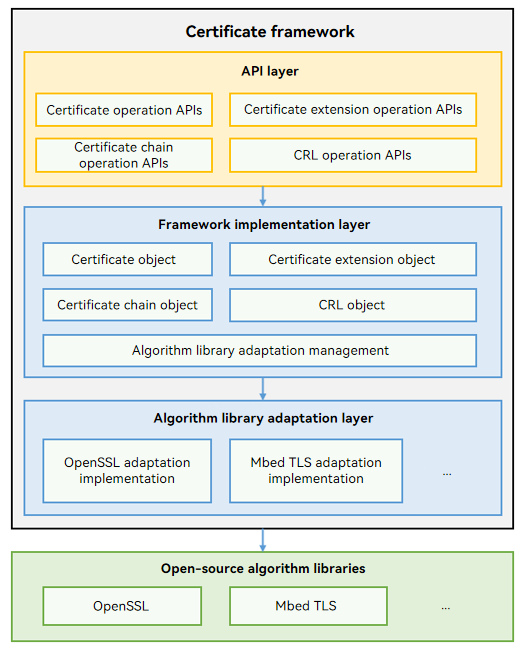

# Certificate Framework

## Introduction
The certificate framework shields the implementation differences of third-party certificate algorithm libraries. It provides the capabilities of parsing and verifying certificates, certificate extensions, and certificate revocation lists (CRLs), and verifying certificate chains. You can use the APIs provided by the certificate framework to easily complete your development. 

**Figure 1** Certificate framework architecture




The certificate framework consists of the following:

-   API layer: provides unified JavaScript interfaces to implement capabilities, including parsing certificates, certificate extensions, and CRLs and verifying certificate chains.
    * Certificate operations include obtaining the version number, serial number (SN), issuer, subject, signature algorithm, and public key of the certificate based on the certificate data passed by the service.
    * Certificate extension operations include obtaining the object identifier (OID) list of the certificate extensions based on the certificate extension fields passed by the service and obtaining specific data based on the OID.
    * CRL operations include obtaining revoked certificates, SNs, issuers, and revocation time of the certificates based on the CRL.
    * Certificate chain operations include verifying the validity of a certificate chain based on the certificate chain data passed by the service.
-   Framework implementation layer: manages internal objects and flexibly loads the algorithm library adaptation layer to adapt to the algorithm and shield differences between the third-party algorithm libraries.
-   Algorithm library adaptation layer: calls specific APIs of the OpenSSL or Mbed TLS algorithm library to provide capabilities, such as parsing certificates and obtaining certificate fields, for services.

## Directory Structure
```
base/security/certificate_framwork
├── bundle.json              # Component configuration file
├── cf.gni                   # Compilation configuration file
├── config                   # Configuration related to the build
├── figures                  # Figures used in the README
├── frameworks               # Framework implementation layer
│   ├── ability              # Abilities of the framework layer
│   ├── adapter              # Algorithm library adaptation layer
│   ├── common               # Common methods relied on internally
│   ├── core                 # Certificate framework implementation
│   └── js
│       └── napi             # JS interfaces encapsulated by NAPI
├── interfaces               # APIs exposed externally
└── test                     # Test cases
```

## Building the Certificate Framework

In the root directory of the OpenHarmony source code, run the following command to separately build the certificate framework component:
```shell
./build.sh --product-name rk3568 --ccache --build-target certificate_framework
```
> **NOTE**
> 
> --**product-name** indicates the product name, for example, **rk3568**.
>
> --**ccache** indicates the cache function used during the compilation.
>
> --**build-target** indicates the name of the component to build.


## Usage

### Available APIs


### How to Use


## Repositories Involved

[Security subsystem](https://gitee.com/openharmony/docs/blob/master/en/readme/Security.md)

[security\_crypto\_framework](https://gitee.com/openharmony/security_crypto_framework)

[**security\_certificate\_framework**](https://gitee.com/openharmony-sig/security_certificate_framework)
