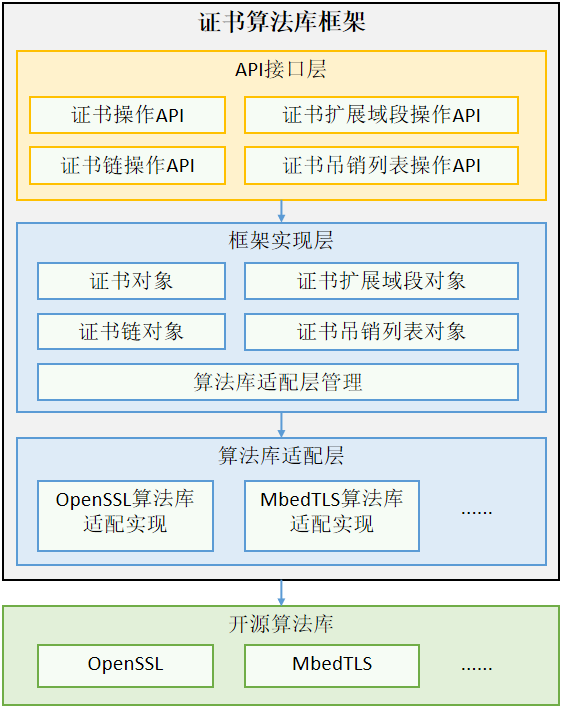

# 证书算法库框架

## 简介
证书算法库框架是一个屏蔽了第三方证书算法库实现差异的算法框架，提供证书、证书扩展域段、证书吊销列表的解析及校验能力，此外还提供了证书链的校验能力。开发者可以通过调用证书算法库框架接口，忽略底层不同三方算法库的差异，实现迅捷开发。
**图 1**  证书算法库框架-架构图




其中，

-   API接口层：对外提供统一的JS接口，提供的能力包括：证书、证书扩展域段、证书吊销列表等。
-   框架实现层：通过灵活加载算法库适配层，适配并屏蔽三方算法库的差异。
-   算法库适配层：实现具体三方算法库的功能。

## 目录
```
base/security/certificate_framwork
├── bundle.json              # 部件配置文件
├── cf.gni                   # 编译配置文件
├── config                   # 配置构建相关
├── figures                  # README相关图片
├── frameworks               # 框架实现层
│   ├── ability              # 框架层能力注册
│   ├── adapter              # 算法库适配层
│   ├── common               # 内部依赖的公共方法
│   ├── core                 # 证书算法库框架核心实现
│   └── js
│       └── napi             # 通过napi封装的JS接口代码实现
├── interfaces               # 对外接口目录
└── test                     # 测试用例
```

## 编译构建

在OpenHarmony源码根目录下，调用以下指令，单独编译证书算法库框架部件。
```shell
./build.sh --product-name rk3568 --ccache --build-target certificate_framework
```
> **说明：**
--product-name：产品名称，例如rk3568。
--ccache：编译时使用缓存功能。
--build-target: 编译的部件名称。


## 说明

### 接口说明


### 使用说明


## 相关仓

[安全子系统](https://gitee.com/openharmony/docs/blob/master/zh-cn/readme/安全子系统.md)

[security\_crypto\_framework](https://gitee.com/openharmony/security_crypto_framework)

[**security\_certificate\_framework**](https://gitee.com/openharmony-sig/security_certificate_framework)